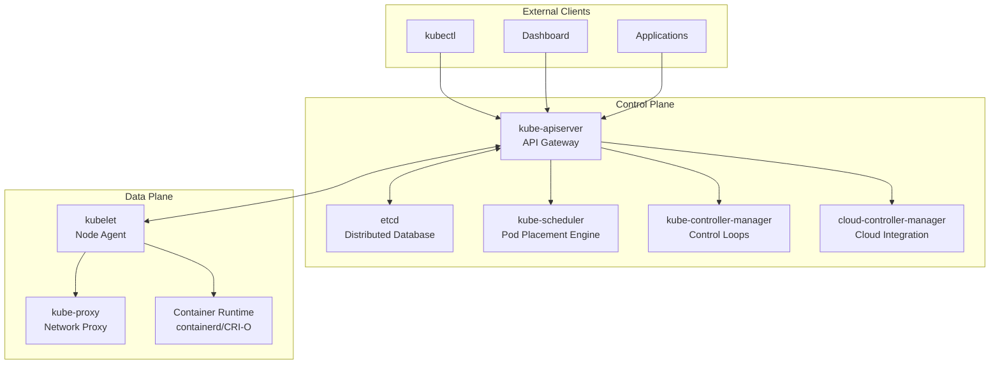
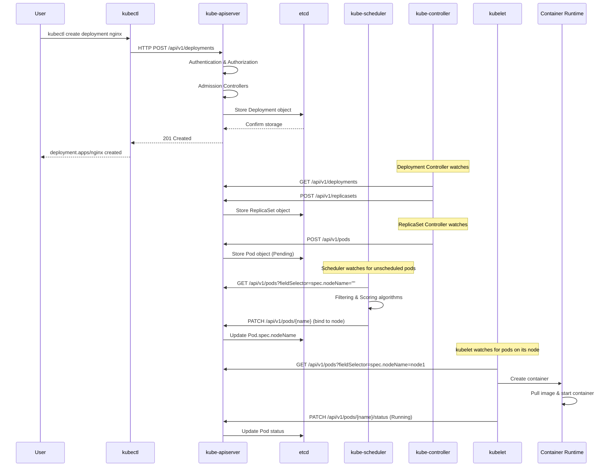
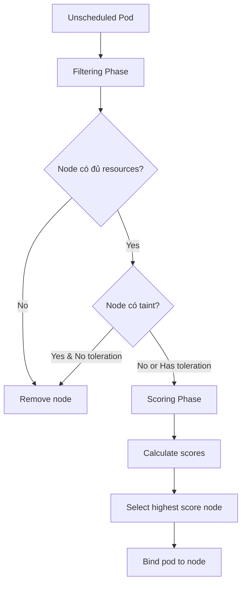
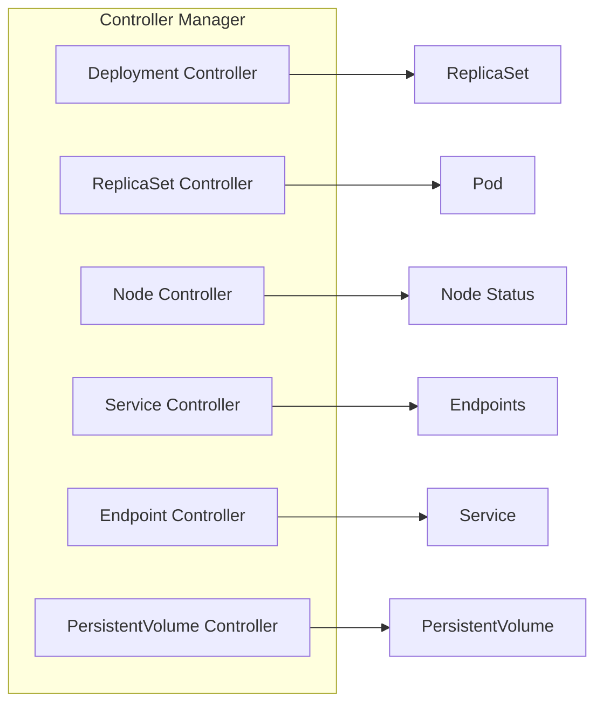
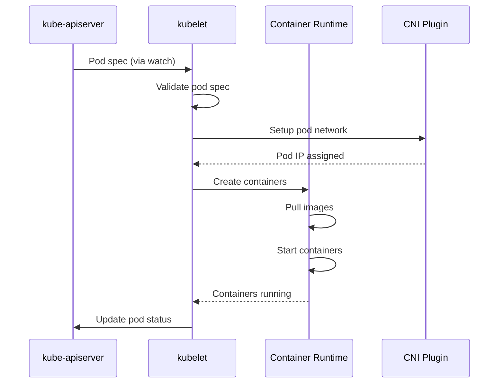
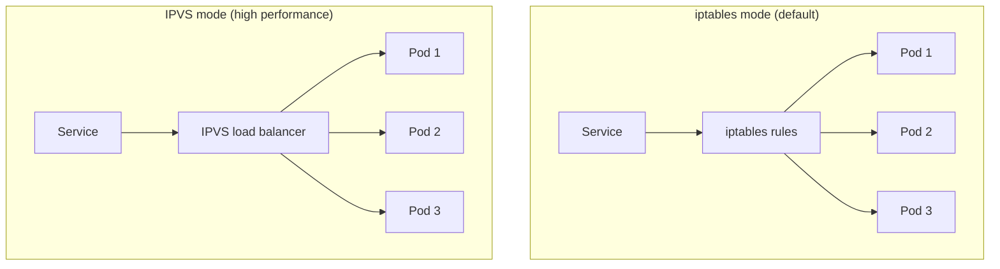
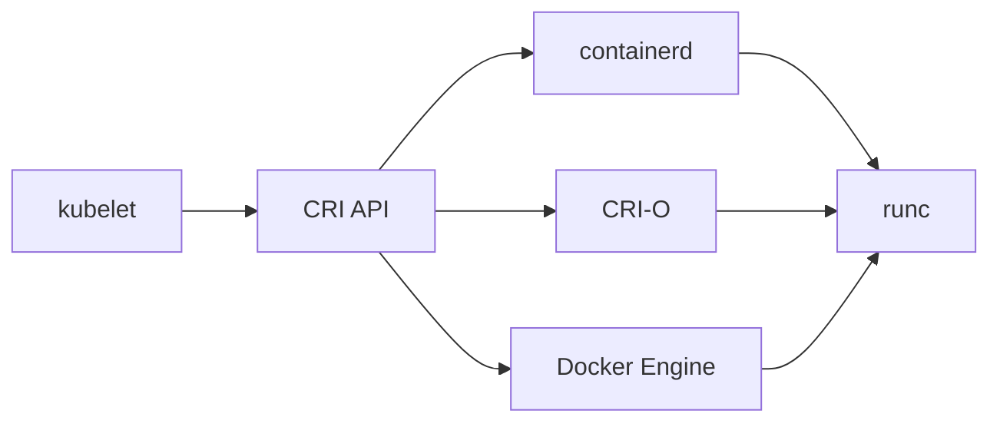
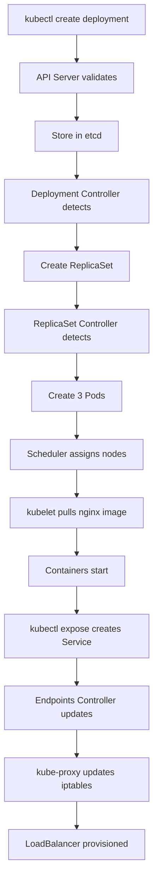

# Kiến trúc Kubernetes - Lý thuyết chuyên sâu

## 🏗️ Tổng quan kiến trúc hệ thống

Kubernetes được thiết kế theo mô hình **Master-Worker** với sự phân tách rõ ràng giữa **Control Plane** (não bộ) và **Data Plane** (cơ bắp).

### 🧠 Control Plane - Bộ não của cluster



### 🔄 Luồng xử lý từ kubectl → container



## 🔍 Chi tiết từng component

### 1. kube-apiserver - Cổng vào duy nhất

**Vai trò**: 
- REST API server cho toàn bộ cluster
- Xác thực, phân quyền, validation
- Admission controllers
- Proxy tới etcd

**Tại sao quan trọng**:
- Single point of truth cho cluster state
- Stateless - có thể scale horizontal
- Tất cả components khác chỉ giao tiếp qua API server

```yaml
# /etc/kubernetes/manifests/kube-apiserver.yaml
apiVersion: v1
kind: Pod
metadata:
  name: kube-apiserver
spec:
  containers:
  - name: kube-apiserver
    image: k8s.gcr.io/kube-apiserver:v1.28.0
    command:
    - kube-apiserver
    - --advertise-address=192.168.1.100
    - --etcd-servers=https://127.0.0.1:2379
    - --audit-log-path=/var/log/audit.log
    - --audit-policy-file=/etc/kubernetes/audit-policy.yaml
```

### 2. etcd - Bộ não lưu trữ

**Vai trò**:
- Distributed key-value store
- Lưu trữ toàn bộ cluster state
- RAFT consensus algorithm
- Watch mechanism cho real-time updates

**Cấu trúc dữ liệu**:
```
/registry/
├── pods/
│   ├── default/
│   │   └── nginx-xxx
├── deployments/
│   └── default/
│       └── nginx
├── services/
├── configmaps/
└── secrets/
```

**Tại sao critical**:
- Mất etcd = mất toàn bộ cluster state
- Performance của etcd ảnh hưởng trực tiếp tới cluster
- Cần backup thường xuyên

### 3. kube-scheduler - Bộ phân bổ thông minh

**Vai trò**:
- Quyết định pod chạy trên node nào
- 2-phase process: Filtering + Scoring
- Pluggable scheduling framework

**Thuật toán scheduling**:



**Filtering predicates**:
- NodeResourcesFit: CPU, Memory, Storage
- NodeAffinity: Node selectors
- PodAffinity/AntiAffinity: Pod placement rules
- Taints/Tolerations: Node restrictions

**Scoring priorities**:
- LeastRequestedPriority: Prefer nodes with less resource usage
- BalancedResourceAllocation: Balance CPU/Memory ratio
- NodeAffinityPriority: Prefer nodes matching affinity

### 4. kube-controller-manager - Bộ điều khiển

**Vai trò**:
- Chạy các control loops
- Đảm bảo desired state = actual state
- Reconciliation pattern

**Các controllers quan trọng**:



**Control Loop Pattern**:
```go
for {
    desired := getDesiredState()
    current := getCurrentState()
    
    if desired != current {
        makeChanges(desired, current)
    }
    
    sleep(reconcileInterval)
}
```

## 🛠️ Data Plane - Nơi workload chạy

### 1. kubelet - Agent trên mỗi node

**Vai trò**:
- Pod lifecycle management
- Container health monitoring
- Resource monitoring
- Volume management

**Quy trình tạo Pod**:



### 2. kube-proxy - Network proxy

**Vai trò**:
- Implement Service abstraction
- Load balancing
- Network rules management

**Service Implementation modes**:



### 3. Container Runtime - Thực thi containers

**Vai trò**:
- Pull images
- Create/start/stop containers
- Manage container lifecycle

**CRI (Container Runtime Interface)**:


## 🎯 Tình huống thực tế: Deploy một web application

Hãy theo dõi toàn bộ luồng khi deploy một ứng dụng web:

```bash
kubectl create deployment webapp --image=nginx:1.21 --replicas=3
kubectl expose deployment webapp --port=80 --type=LoadBalancer
```

### Luồng xử lý chi tiết:



## 🔧 Troubleshooting thường gặp

### 1. Pod stuck in Pending
```bash
kubectl describe pod <pod-name>
# Check: Resources, NodeSelector, Taints/Tolerations
```

### 2. API Server không accessible
```bash
# Check control plane pods
kubectl get pods -n kube-system
# Check certificates
openssl x509 -in /etc/kubernetes/pki/apiserver.crt -text -noout
```

### 3. etcd corruption
```bash
# Backup etcd
ETCDCTL_API=3 etcdctl snapshot save backup.db
# Restore from backup
ETCDCTL_API=3 etcdctl snapshot restore backup.db
```

## 💡 Best Practices

### 1. High Availability Control Plane
- Chạy 3 hoặc 5 control plane nodes (odd numbers)
- etcd cluster với 3+ members
- Load balancer cho API server

### 2. Security
- Enable audit logging
- Rotate certificates định kỳ
- Network policies cho control plane

### 3. Monitoring
- Monitor etcd performance
- API server latency
- Controller manager lag

## 🤔 Câu hỏi suy ngẫm

1. **Tại sao Kubernetes cần etcd thay vì database thông thường?**
   - Consistency requirements
   - Watch mechanism
   - Distributed consensus

2. **Điều gì xảy ra nếu kube-scheduler down?**
   - Pods mới sẽ stuck ở Pending
   - Pods hiện tại vẫn chạy bình thường
   - kubelet vẫn manage pods đã scheduled

3. **Làm thế nào để scale Control Plane?**
   - Add more API server instances (stateless)
   - Scale etcd cluster (odd numbers)
   - Use load balancer

4. **Tại sao cần RBAC cho kube-apiserver?**
   - Principle of least privilege
   - Multi-tenancy
   - Audit trail