# Core Objects - Lý thuyết chuyên sâu

## 🎯 Tổng quan Core Objects

Kubernetes Core Objects là những building blocks cơ bản để chạy applications. Chúng được thiết kế theo nguyên tắc **composition over inheritance**.

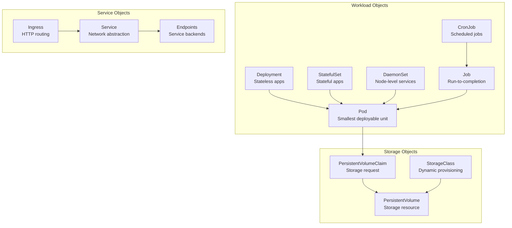

## 🏗️ Pod - Đơn vị cơ bản nhất

### Bản chất của Pod

Pod không phải là container, mà là **wrapper** xung quanh 1 hoặc nhiều containers:

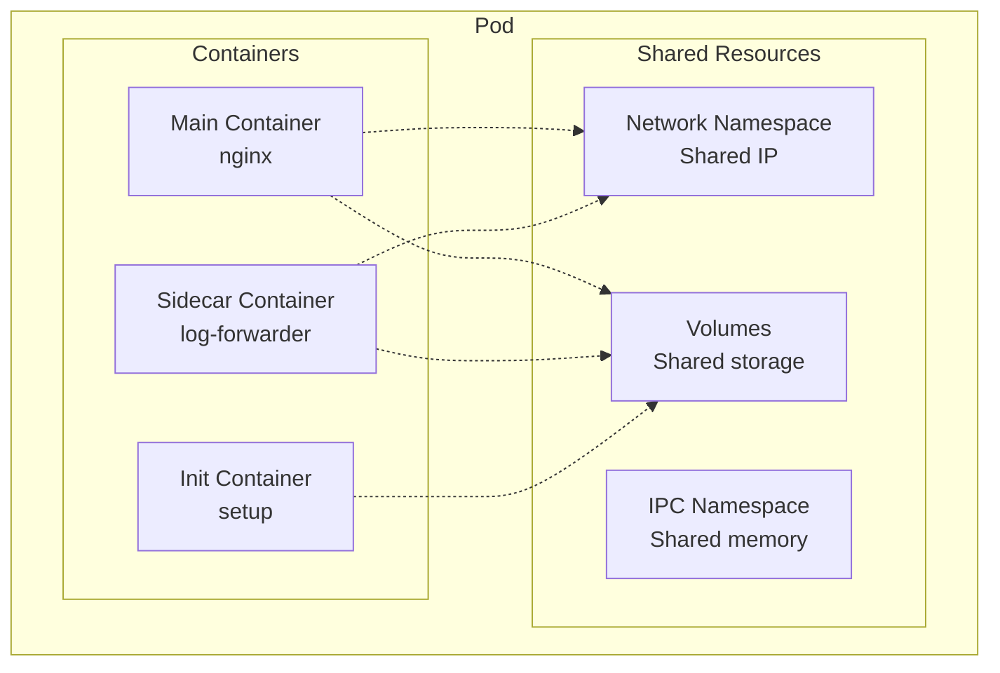

### Pod Lifecycle chi tiết

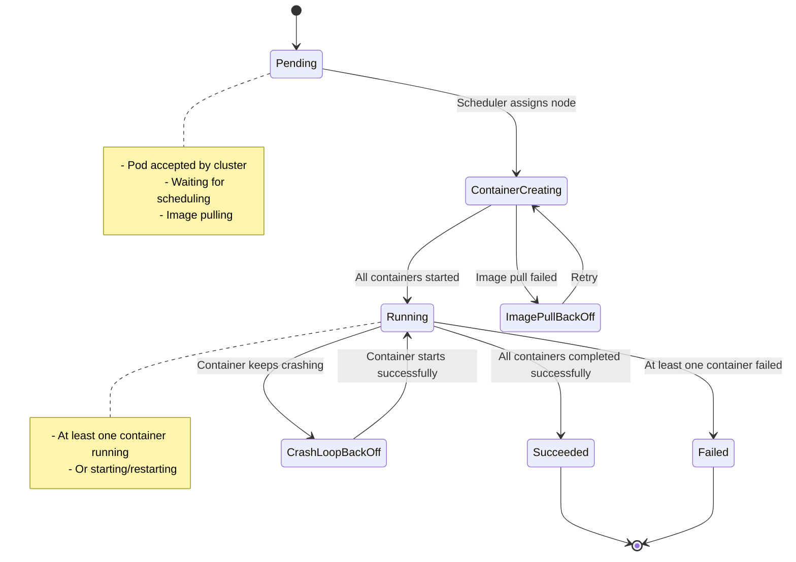

### Pod Design Patterns

#### 1. Sidecar Pattern
```yaml
apiVersion: v1
kind: Pod
metadata:
  name: sidecar-example
spec:
  containers:
  # Main application
  - name: web-server
    image: nginx
    volumeMounts:
    - name: shared-logs
      mountPath: /var/log/nginx
  
  # Sidecar: Log forwarder
  - name: log-forwarder
    image: fluent/fluent-bit
    volumeMounts:
    - name: shared-logs
      mountPath: /var/log/nginx
      readOnly: true
  
  volumes:
  - name: shared-logs
    emptyDir: {}
```

#### 2. Init Container Pattern
```yaml
apiVersion: v1
kind: Pod
metadata:
  name: init-example
spec:
  initContainers:
  - name: init-db
    image: busybox
    command: ['sh', '-c', 'until nslookup mydb; do sleep 2; done']
  
  containers:
  - name: web-app
    image: nginx
```

#### 3. Ambassador Pattern
```yaml
apiVersion: v1
kind: Pod
metadata:
  name: ambassador-example
spec:
  containers:
  - name: web-app
    image: my-app
    env:
    - name: DB_HOST
      value: "localhost"  # Connect to ambassador
  
  - name: db-ambassador
    image: ambassador/ambassador
    # Proxy connections to actual database
```

## 🚀 Deployment - Quản lý Stateless Apps

### Deployment Controller Logic

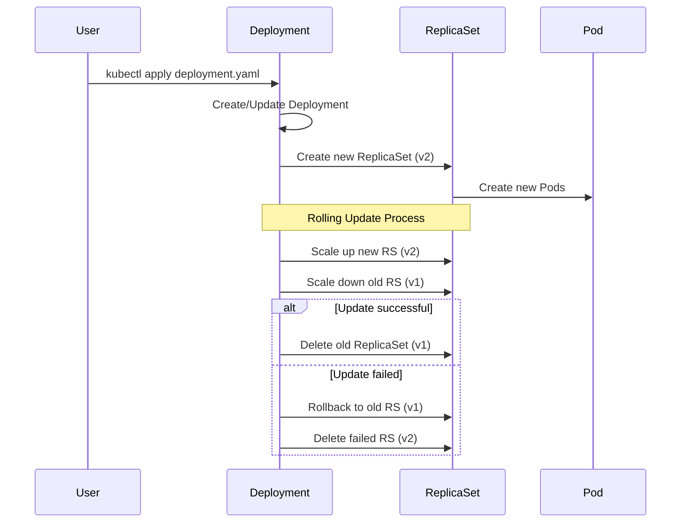

### Rolling Update Strategies

#### 1. RollingUpdate (Default)
```yaml
strategy:
  type: RollingUpdate
  rollingUpdate:
    maxSurge: 25%        # Tối đa 25% pods mới
    maxUnavailable: 25%  # Tối đa 25% pods unavailable
```

**Ví dụ với 4 replicas**:
```mermaid
gantt
    title Rolling Update Timeline
    dateFormat X
    axisFormat %s
    
    section Old Pods
    Pod 1 (v1) :active, old1, 0, 6
    Pod 2 (v1) :active, old2, 0, 8
    Pod 3 (v1) :active, old3, 0, 10
    Pod 4 (v1) :active, old4, 0, 12
    
    section New Pods
    Pod 5 (v2) :new1, 2, 14
    Pod 6 (v2) :new2, 4, 14
    Pod 7 (v2) :new3, 6, 14
    Pod 8 (v2) :new4, 8, 14
```

#### 2. Recreate Strategy
```yaml
strategy:
  type: Recreate
```

```mermaid
gantt
    title Recreate Strategy Timeline
    dateFormat X
    axisFormat %s
    
    section Old Pods
    All Pods (v1) :active, old, 0, 4
    
    section Downtime
    No Pods :crit, down, 4, 6
    
    section New Pods
    All Pods (v2) :new, 6, 10
```

### Deployment Best Practices

#### Resource Management
```yaml
spec:
  template:
    spec:
      containers:
      - name: app
        resources:
          requests:
            memory: "64Mi"
            cpu: "250m"
          limits:
            memory: "128Mi"
            cpu: "500m"
```

#### Health Checks
```yaml
livenessProbe:
  httpGet:
    path: /health
    port: 8080
  initialDelaySeconds: 30
  periodSeconds: 10
  timeoutSeconds: 5
  failureThreshold: 3

readinessProbe:
  httpGet:
    path: /ready
    port: 8080
  initialDelaySeconds: 5
  periodSeconds: 5
  timeoutSeconds: 3
  failureThreshold: 3
```

**Sự khác biệt giữa Liveness và Readiness**:

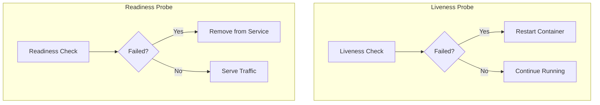

## 🗃️ StatefulSet - Stateful Applications

### StatefulSet vs Deployment

| Aspect | Deployment | StatefulSet |
|--------|------------|-------------|
| Pod Names | Random (nginx-abc123) | Ordered (mysql-0, mysql-1) |
| Network Identity | Dynamic IP | Stable hostname |
| Storage | Shared or none | Dedicated per pod |
| Scaling | Parallel | Sequential |
| Updates | Rolling | Rolling (ordered) |

### StatefulSet Guarantees

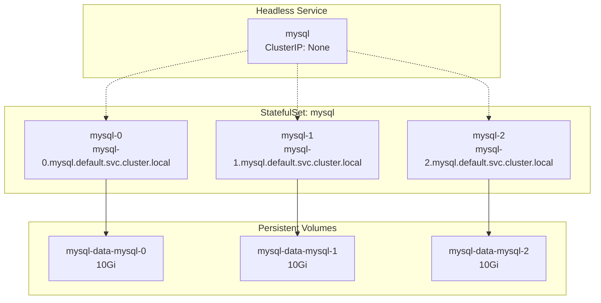

### Scaling StatefulSet

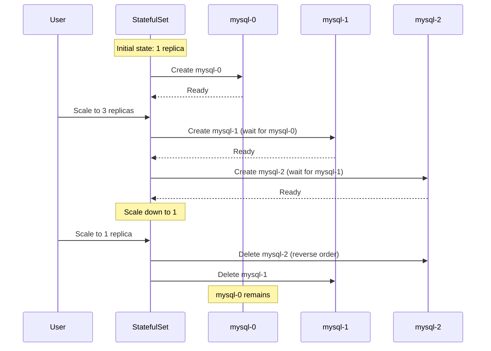

## 🌐 Service - Network Abstraction

### Service Types Deep Dive

#### 1. ClusterIP (Default)
```yaml
apiVersion: v1
kind: Service
metadata:
  name: my-service
spec:
  type: ClusterIP
  selector:
    app: my-app
  ports:
  - port: 80
    targetPort: 8080
```

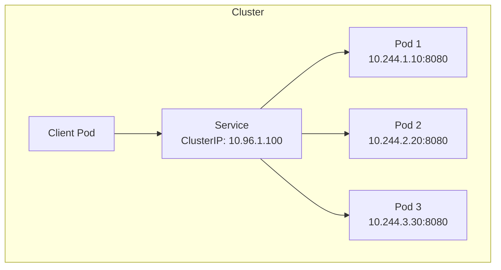

#### 2. NodePort
```yaml
spec:
  type: NodePort
  ports:
  - port: 80
    targetPort: 8080
    nodePort: 30080
```

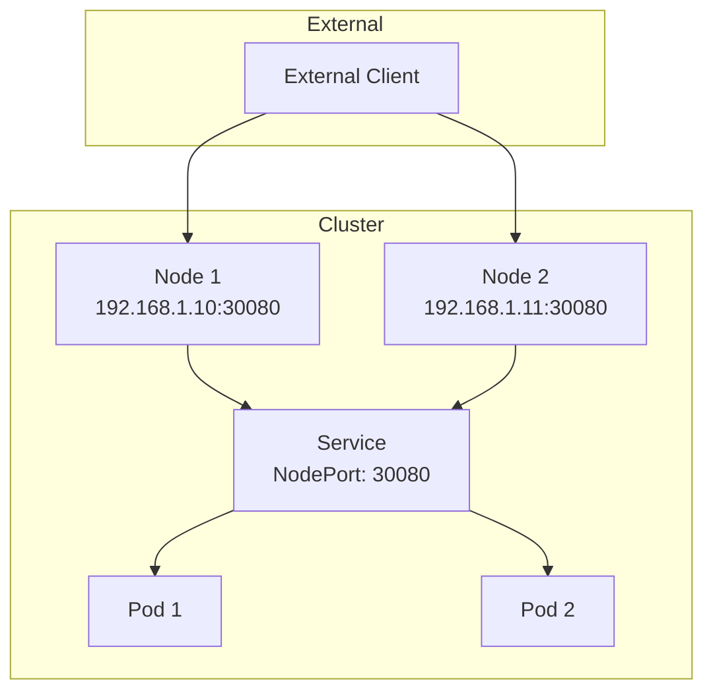

#### 3. LoadBalancer
```yaml
spec:
  type: LoadBalancer
  ports:
  - port: 80
    targetPort: 8080
```

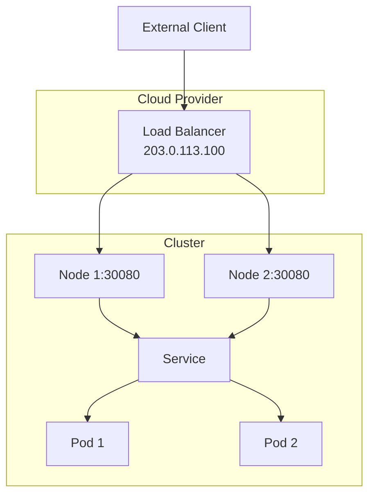

### Service Discovery

#### DNS-based Discovery
```bash
# Trong cluster, pods có thể access service qua:
curl http://my-service.default.svc.cluster.local
curl http://my-service.default.svc
curl http://my-service  # same namespace
```

#### Environment Variables
```bash
# Kubernetes tự động inject env vars
MY_SERVICE_SERVICE_HOST=10.96.1.100
MY_SERVICE_SERVICE_PORT=80
```

### Endpoints Controller

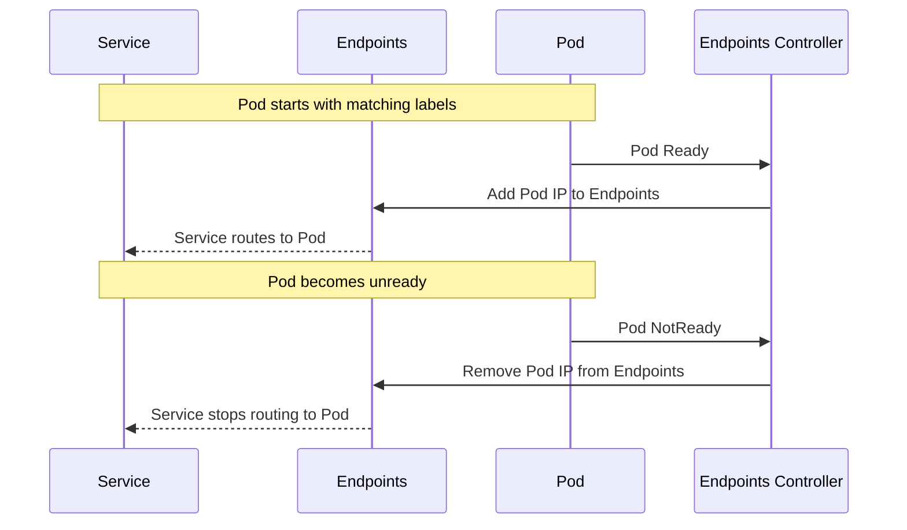

## ⚡ Job & CronJob - Batch Workloads

### Job Patterns

#### 1. Single Job
```yaml
apiVersion: batch/v1
kind: Job
metadata:
  name: single-job
spec:
  template:
    spec:
      containers:
      - name: worker
        image: busybox
        command: ["echo", "Hello World"]
      restartPolicy: Never
```

#### 2. Parallel Jobs với Work Queue
```yaml
apiVersion: batch/v1
kind: Job
metadata:
  name: parallel-job
spec:
  parallelism: 3
  completions: 6
  template:
    spec:
      containers:
      - name: worker
        image: my-worker
        command: ["process-item"]
      restartPolicy: Never
```

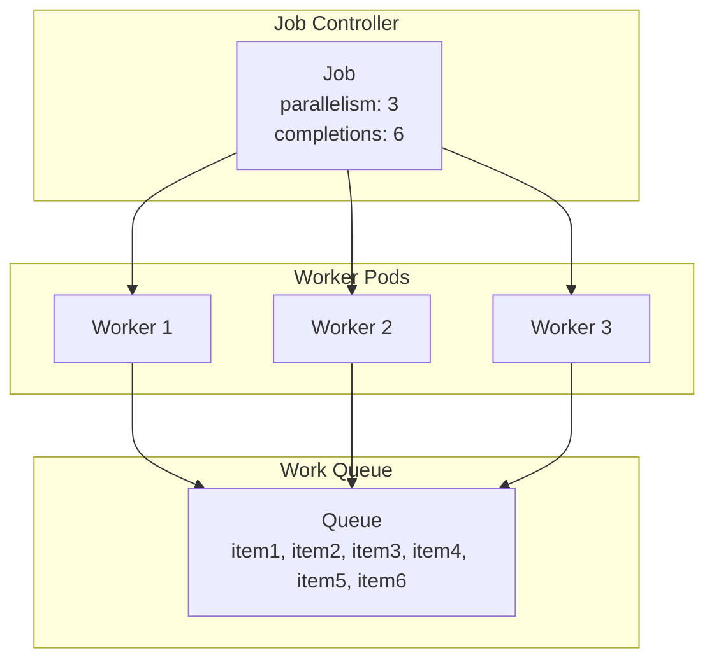

### CronJob Scheduling

```yaml
apiVersion: batch/v1
kind: CronJob
metadata:
  name: backup-job
spec:
  schedule: "0 2 * * *"  # Daily at 2 AM
  jobTemplate:
    spec:
      template:
        spec:
          containers:
          - name: backup
            image: backup-tool
            command: ["backup-database"]
          restartPolicy: OnFailure
  successfulJobsHistoryLimit: 3
  failedJobsHistoryLimit: 1
```

**Cron Schedule Examples**:
```
0 2 * * *     # Daily at 2 AM
*/15 * * * *  # Every 15 minutes
0 0 * * 0     # Weekly on Sunday
0 0 1 * *     # Monthly on 1st day
```

## 🎯 Tình huống thực tế: E-commerce Application

Hãy xem cách deploy một ứng dụng e-commerce hoàn chỉnh:

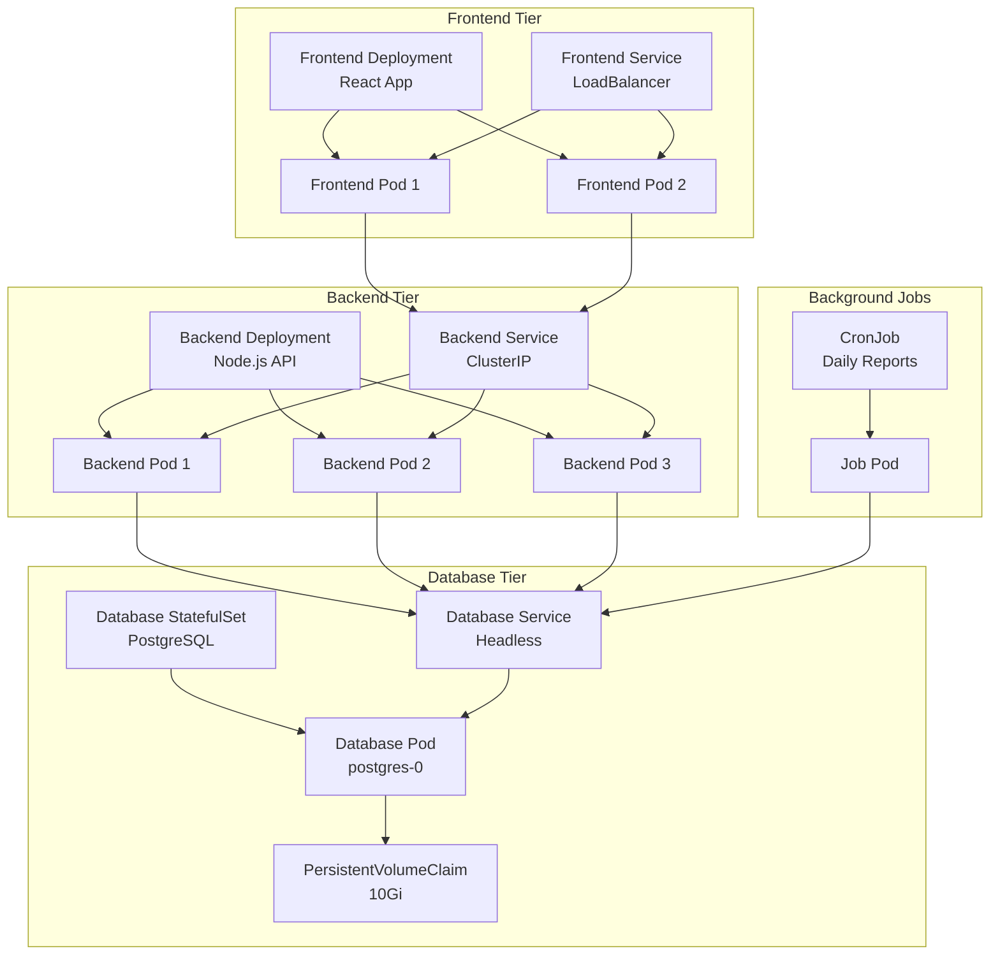

## 🔧 Troubleshooting Common Issues

### 1. Pod Stuck in Pending
```bash
kubectl describe pod <pod-name>
# Common causes:
# - Insufficient resources
# - Node selector mismatch
# - Taints/tolerations
# - PVC not bound
```

### 2. ImagePullBackOff
```bash
kubectl describe pod <pod-name>
# Common causes:
# - Wrong image name/tag
# - Private registry without credentials
# - Network issues
```

### 3. CrashLoopBackOff
```bash
kubectl logs <pod-name> --previous
# Common causes:
# - Application error
# - Missing configuration
# - Health check failures
```

### 4. Service Not Accessible
```bash
kubectl get endpoints <service-name>
kubectl describe service <service-name>
# Common causes:
# - Wrong selector labels
# - Pods not ready
# - Port mismatch
```

## 💡 Best Practices

### 1. Resource Management
```yaml
resources:
  requests:
    memory: "64Mi"
    cpu: "250m"
  limits:
    memory: "128Mi"
    cpu: "500m"
```

### 2. Labels và Selectors
```yaml
metadata:
  labels:
    app: my-app
    version: v1.0.0
    component: backend
    tier: api
```

### 3. Health Checks
- **Liveness**: Restart container nếu unhealthy
- **Readiness**: Remove từ service nếu not ready
- **Startup**: Cho phép slow-starting containers

### 4. Security
```yaml
securityContext:
  runAsNonRoot: true
  runAsUser: 1000
  readOnlyRootFilesystem: true
  allowPrivilegeEscalation: false
```

## 🤔 Câu hỏi suy ngẫm

1. **Khi nào nên dùng StatefulSet thay vì Deployment?**
   - Cần stable network identity
   - Ordered deployment/scaling
   - Persistent storage per pod

2. **Tại sao cần readiness probe khác với liveness probe?**
   - Liveness: Container health
   - Readiness: Application ready to serve

3. **Làm thế nào để zero-downtime deployment?**
   - Rolling update với maxUnavailable: 0
   - Proper readiness probes
   - Graceful shutdown

4. **Service mesh có thay thế được Service không?**
   - Service mesh bổ sung, không thay thế
   - Service: L4 load balancing
   - Service mesh: L7 features (retry, circuit breaker, etc.)