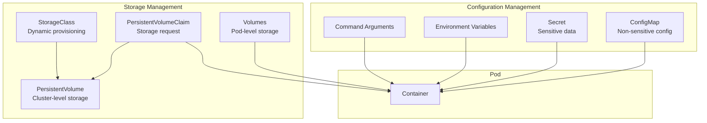
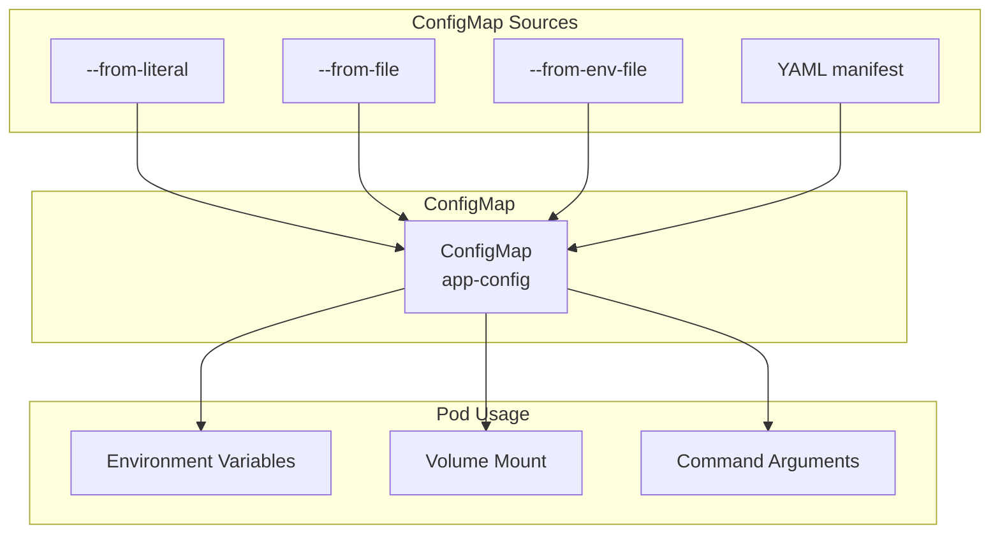
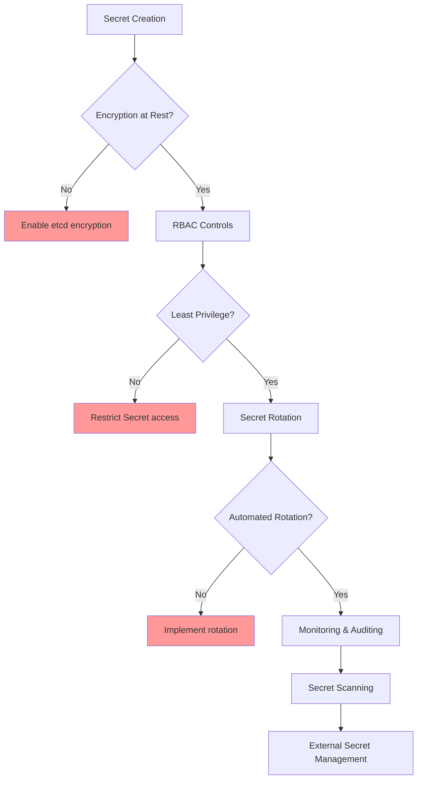
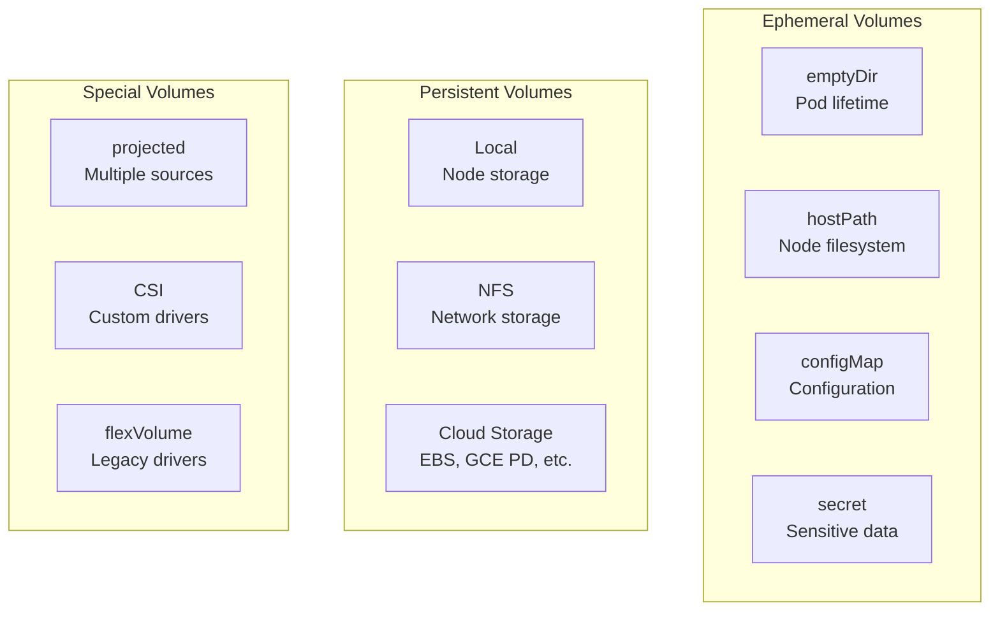
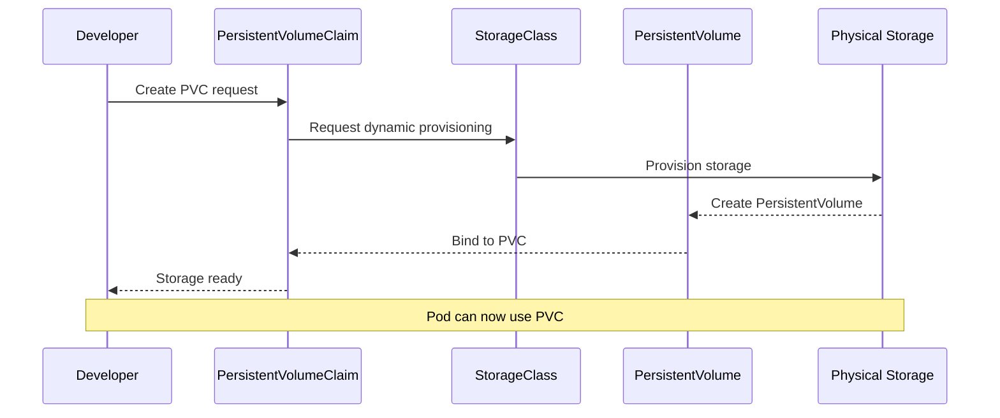
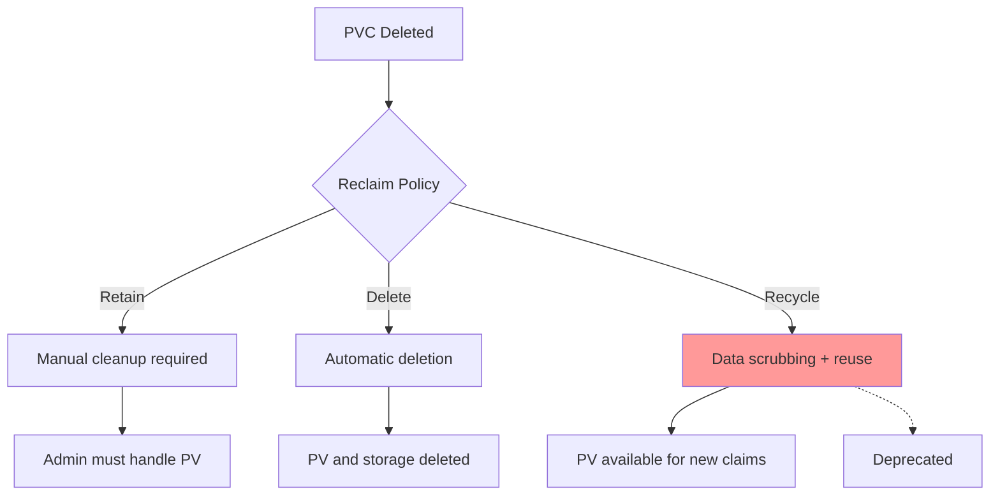
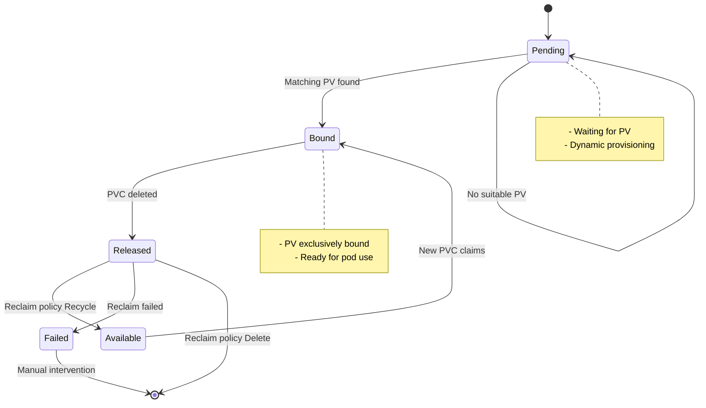
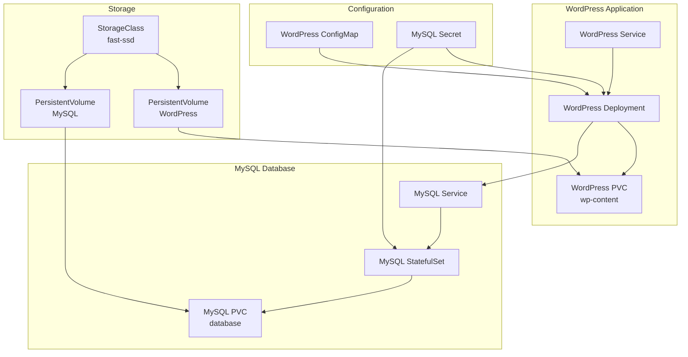

# Config & Storage - Lý thuyết chuyên sâu

## 🎯 Tổng quan Configuration và Storage

Kubernetes cung cấp nhiều cách để quản lý configuration và persistent data, từ simple key-value pairs đến complex storage systems.



## 📋 ConfigMap - Configuration Management

### ConfigMap Patterns

#### 1. Key-Value Configuration
```yaml
apiVersion: v1
kind: ConfigMap
metadata:
  name: app-config
data:
  database_url: "postgresql://localhost:5432/mydb"
  debug_mode: "true"
  max_connections: "100"
  log_level: "info"
```

#### 2. File-based Configuration
```yaml
apiVersion: v1
kind: ConfigMap
metadata:
  name: nginx-config
data:
  nginx.conf: |
    user nginx;
    worker_processes auto;
    
    events {
        worker_connections 1024;
    }
    
    http {
        include /etc/nginx/mime.types;
        default_type application/octet-stream;
        
        server {
            listen 80;
            location / {
                root /usr/share/nginx/html;
                index index.html;
            }
        }
    }
  
  index.html: |
    <!DOCTYPE html>
    <html>
    <head><title>My App</title></head>
    <body><h1>Hello from ConfigMap!</h1></body>
    </html>
```

### ConfigMap Usage Patterns



#### Environment Variables
```yaml
spec:
  containers:
  - name: app
    image: my-app
    env:
    - name: DATABASE_URL
      valueFrom:
        configMapKeyRef:
          name: app-config
          key: database_url
    envFrom:
    - configMapRef:
        name: app-config
```

#### Volume Mounts
```yaml
spec:
  containers:
  - name: nginx
    image: nginx
    volumeMounts:
    - name: config-volume
      mountPath: /etc/nginx/nginx.conf
      subPath: nginx.conf
  volumes:
  - name: config-volume
    configMap:
      name: nginx-config
```

## 🔐 Secret - Sensitive Data Management

### Secret Types

| Type | Usage | Example |
|------|-------|---------|
| Opaque | Generic secret | API keys, passwords |
| kubernetes.io/dockerconfigjson | Docker registry | Private image pulls |
| kubernetes.io/tls | TLS certificates | HTTPS endpoints |
| kubernetes.io/service-account-token | Service account | API access |

### Secret Creation Methods

#### 1. From Literal Values
```bash
kubectl create secret generic db-secret \
  --from-literal=username=admin \
  --from-literal=password=secretpassword
```

#### 2. From Files
```bash
kubectl create secret generic ssl-certs \
  --from-file=tls.crt=server.crt \
  --from-file=tls.key=server.key
```

#### 3. Docker Registry Secret
```bash
kubectl create secret docker-registry regcred \
  --docker-server=myregistry.com \
  --docker-username=myuser \
  --docker-password=mypassword \
  --docker-email=myemail@example.com
```

### Secret Security Best Practices



#### Encryption at Rest
```yaml
# /etc/kubernetes/encryption-config.yaml
apiVersion: apiserver.config.k8s.io/v1
kind: EncryptionConfiguration
resources:
- resources:
  - secrets
  providers:
  - aescbc:
      keys:
      - name: key1
        secret: <base64-encoded-32-byte-key>
  - identity: {}
```

#### RBAC for Secrets
```yaml
apiVersion: rbac.authorization.k8s.io/v1
kind: Role
metadata:
  name: secret-reader
rules:
- apiGroups: [""]
  resources: ["secrets"]
  verbs: ["get", "list"]
  resourceNames: ["db-secret"]  # Specific secret only
```

## 💾 Volumes - Storage Abstraction

### Volume Types Overview



### emptyDir - Temporary Storage
```yaml
apiVersion: v1
kind: Pod
metadata:
  name: emptydir-example
spec:
  containers:
  - name: writer
    image: busybox
    command: ["sh", "-c", "echo 'Hello' > /shared/message; sleep 3600"]
    volumeMounts:
    - name: shared-data
      mountPath: /shared
  
  - name: reader
    image: busybox
    command: ["sh", "-c", "while true; do cat /shared/message; sleep 10; done"]
    volumeMounts:
    - name: shared-data
      mountPath: /shared
  
  volumes:
  - name: shared-data
    emptyDir:
      sizeLimit: 1Gi
      medium: Memory  # tmpfs for performance
```

### hostPath - Node Storage
```yaml
volumes:
- name: host-storage
  hostPath:
    path: /var/log/pods
    type: DirectoryOrCreate
```

**⚠️ hostPath Security Risks**:
- Pod có thể access node filesystem
- Chỉ dùng cho system pods hoặc debugging
- Không portable across nodes

## 🗄️ PersistentVolume & PersistentVolumeClaim

### Storage Architecture



### Static Provisioning
```yaml
# PersistentVolume
apiVersion: v1
kind: PersistentVolume
metadata:
  name: pv-nfs
spec:
  capacity:
    storage: 10Gi
  accessModes:
  - ReadWriteMany
  persistentVolumeReclaimPolicy: Retain
  nfs:
    server: nfs-server.example.com
    path: /exports/data

---
# PersistentVolumeClaim
apiVersion: v1
kind: PersistentVolumeClaim
metadata:
  name: pvc-nfs
spec:
  accessModes:
  - ReadWriteMany
  resources:
    requests:
      storage: 5Gi
```

### Dynamic Provisioning với StorageClass
```yaml
apiVersion: storage.k8s.io/v1
kind: StorageClass
metadata:
  name: fast-ssd
provisioner: kubernetes.io/aws-ebs
parameters:
  type: gp3
  iops: "3000"
  throughput: "125"
  encrypted: "true"
allowVolumeExpansion: true
volumeBindingMode: WaitForFirstConsumer
reclaimPolicy: Delete

---
apiVersion: v1
kind: PersistentVolumeClaim
metadata:
  name: app-storage
spec:
  accessModes:
  - ReadWriteOnce
  storageClassName: fast-ssd
  resources:
    requests:
      storage: 20Gi
```

### Access Modes

| Mode | Description | Use Case |
|------|-------------|----------|
| ReadWriteOnce (RWO) | Single node read-write | Databases, single-instance apps |
| ReadOnlyMany (ROX) | Multiple nodes read-only | Static content, shared configs |
| ReadWriteMany (RWX) | Multiple nodes read-write | Shared file systems, multi-writer |
| ReadWriteOncePod (RWOP) | Single pod read-write | Exclusive access per pod |

### Reclaim Policies



## 🔄 Volume Lifecycle

### PVC Binding Process



## 🎯 Tình huống thực tế: WordPress với MySQL



### Configuration Flow
```yaml
# MySQL Secret
apiVersion: v1
kind: Secret
metadata:
  name: mysql-secret
type: Opaque
data:
  mysql-root-password: <base64-encoded>
  mysql-user: <base64-encoded>
  mysql-password: <base64-encoded>
  mysql-database: <base64-encoded>

---
# WordPress ConfigMap
apiVersion: v1
kind: ConfigMap
metadata:
  name: wordpress-config
data:
  WORDPRESS_DB_HOST: mysql:3306
  WORDPRESS_DB_NAME: wordpress
  WORDPRESS_TABLE_PREFIX: wp_
  WORDPRESS_DEBUG: "1"
```

## 🔧 Advanced Storage Patterns

### 1. Multi-Container Shared Storage
```yaml
apiVersion: v1
kind: Pod
metadata:
  name: shared-storage-pod
spec:
  containers:
  - name: producer
    image: busybox
    command: ["sh", "-c", "while true; do echo $(date) >> /shared/log.txt; sleep 5; done"]
    volumeMounts:
    - name: shared-volume
      mountPath: /shared
  
  - name: consumer
    image: busybox
    command: ["sh", "-c", "tail -f /shared/log.txt"]
    volumeMounts:
    - name: shared-volume
      mountPath: /shared
  
  volumes:
  - name: shared-volume
    persistentVolumeClaim:
      claimName: shared-pvc
```

### 2. Init Container Data Setup
```yaml
apiVersion: v1
kind: Pod
metadata:
  name: data-setup-pod
spec:
  initContainers:
  - name: data-downloader
    image: busybox
    command:
    - sh
    - -c
    - |
      echo "Downloading initial data..."
      mkdir -p /data/app
      echo "Initial data" > /data/app/config.json
      echo "Setup completed"
    volumeMounts:
    - name: app-data
      mountPath: /data
  
  containers:
  - name: app
    image: nginx
    volumeMounts:
    - name: app-data
      mountPath: /usr/share/nginx/html
  
  volumes:
  - name: app-data
    persistentVolumeClaim:
      claimName: app-data-pvc
```

### 3. Backup and Restore Pattern
```yaml
apiVersion: batch/v1
kind: CronJob
metadata:
  name: database-backup
spec:
  schedule: "0 2 * * *"
  jobTemplate:
    spec:
      template:
        spec:
          containers:
          - name: backup
            image: postgres:13
            command:
            - sh
            - -c
            - |
              pg_dump -h mysql -U admin mydb > /backup/backup-$(date +%Y%m%d).sql
              find /backup -name "*.sql" -mtime +7 -delete
            env:
            - name: PGPASSWORD
              valueFrom:
                secretKeyRef:
                  name: mysql-secret
                  key: password
            volumeMounts:
            - name: backup-storage
              mountPath: /backup
          volumes:
          - name: backup-storage
            persistentVolumeClaim:
              claimName: backup-pvc
          restartPolicy: OnFailure
```

## 🛡️ Security Best Practices

### 1. Secret Management
```yaml
# Use external secret management
apiVersion: external-secrets.io/v1beta1
kind: SecretStore
metadata:
  name: vault-backend
spec:
  provider:
    vault:
      server: "https://vault.example.com"
      path: "secret"
      auth:
        kubernetes:
          mountPath: "kubernetes"
          role: "myapp"

---
apiVersion: external-secrets.io/v1beta1
kind: ExternalSecret
metadata:
  name: app-secret
spec:
  refreshInterval: 15s
  secretStoreRef:
    name: vault-backend
    kind: SecretStore
  target:
    name: app-secret
    creationPolicy: Owner
  data:
  - secretKey: password
    remoteRef:
      key: myapp/config
      property: password
```

### 2. Storage Security
```yaml
# Pod Security Context
spec:
  securityContext:
    runAsUser: 1000
    runAsGroup: 1000
    fsGroup: 1000
  containers:
  - name: app
    securityContext:
      allowPrivilegeEscalation: false
      readOnlyRootFilesystem: true
      capabilities:
        drop:
        - ALL
    volumeMounts:
    - name: data
      mountPath: /data
      readOnly: false
```

## 📊 Monitoring và Troubleshooting

### Common Issues

#### 1. PVC Stuck in Pending
```bash
kubectl describe pvc my-pvc
# Check: StorageClass exists, sufficient resources, access modes
```

#### 2. Pod Can't Mount Volume
```bash
kubectl describe pod my-pod
# Check: PVC bound, node has access, permissions
```

#### 3. Storage Performance Issues
```bash
kubectl top pods
kubectl exec -it my-pod -- iostat -x 1
```

### Storage Metrics
```yaml
# Monitor storage usage
apiVersion: v1
kind: Pod
metadata:
  name: storage-monitor
spec:
  containers:
  - name: monitor
    image: busybox
    command:
    - sh
    - -c
    - |
      while true; do
        df -h /data
        du -sh /data/*
        sleep 60
      done
    volumeMounts:
    - name: data
      mountPath: /data
```

## 🤔 Câu hỏi suy ngẫm

1. **Khi nào nên dùng ConfigMap vs Secret?**
   - ConfigMap: Non-sensitive configuration
   - Secret: Passwords, tokens, certificates

2. **Static vs Dynamic Provisioning?**
   - Static: Pre-provisioned storage, more control
   - Dynamic: On-demand provisioning, easier management

3. **Làm thế nào để backup persistent data?**
   - Volume snapshots
   - Application-level backups
   - External backup tools

4. **PVC có thể share giữa nhiều pods không?**
   - Depends on access mode (RWX allows sharing)
   - Consider data consistency issues