# Networking - Lý thuyết chuyên sâu

## 🌐 Kubernetes Networking Model

Kubernetes networking được xây dựng trên 4 nguyên tắc cơ bản:


### Network Architecture Overview


## 🔌 Container Network Interface (CNI)

### CNI Architecture


### Popular CNI Plugins

#### 1. Flannel - Simple Overlay Network
```yaml
apiVersion: v1
kind: ConfigMap
metadata:
  name: kube-flannel-cfg
  namespace: kube-system
data:
  cni-conf.json: |
    {
      "name": "cbr0",
      "cniVersion": "0.3.1",
      "plugins": [
        {
          "type": "flannel",
          "delegate": {
            "hairpinMode": true,
            "isDefaultGateway": true
          }
        },
        {
          "type": "portmap",
          "capabilities": {
            "portMappings": true
          }
        }
      ]
    }
  net-conf.json: |
    {
      "Network": "10.244.0.0/16",
      "Backend": {
        "Type": "vxlan"
      }
    }
```

#### 2. Calico - Policy-Rich Networking
```yaml
apiVersion: projectcalico.org/v3
kind: IPPool
metadata:
  name: default-ipv4-ippool
spec:
  cidr: 10.244.0.0/16
  ipipMode: Always
  natOutgoing: true
  disabled: false
  nodeSelector: all()
```

#### 3. Cilium - eBPF-based Networking
```yaml
apiVersion: v1
kind: ConfigMap
metadata:
  name: cilium-config
  namespace: kube-system
data:
  cluster-name: "k8s-cluster"
  cluster-id: "1"
  enable-ipv4: "true"
  enable-ipv6: "false"
  enable-bpf-masquerade: "true"
  enable-host-reachable-services: "true"
```

### CNI Plugin Comparison

| Feature | Flannel | Calico | Cilium | Weave |
|---------|---------|--------|--------|-------|
| Network Policy | ❌ | ✅ | ✅ | ✅ |
| Encryption | ❌ | ✅ | ✅ | ✅ |
| Multi-cluster | ❌ | ✅ | ✅ | ✅ |
| Performance | Good | Very Good | Excellent | Good |
| Complexity | Low | Medium | High | Medium |
| eBPF Support | ❌ | Partial | Full | ❌ |

## 🎯 Service Discovery và Load Balancing

### Service Types Deep Dive

#### 1. ClusterIP - Internal Communication


#### 2. NodePort - External Access


#### 3. LoadBalancer - Cloud Integration


### kube-proxy Implementation Modes

#### 1. iptables Mode (Default)


**iptables rules example**:
```bash
# Service chain
-A KUBE-SERVICES -d 10.96.1.100/32 -p tcp -m tcp --dport 80 -j KUBE-SVC-ABCDEF

# Load balancing to endpoints
-A KUBE-SVC-ABCDEF -m statistic --mode random --probability 0.33333 -j KUBE-SEP-POD1
-A KUBE-SVC-ABCDEF -m statistic --mode random --probability 0.50000 -j KUBE-SEP-POD2
-A KUBE-SVC-ABCDEF -j KUBE-SEP-POD3

# DNAT to actual pod
-A KUBE-SEP-POD1 -p tcp -m tcp -j DNAT --to-destination 10.244.1.10:8080
```

#### 2. IPVS Mode (High Performance)


**IPVS advantages**:
- Better performance for large number of services
- More load balancing algorithms
- Better session affinity support

### DNS trong Kubernetes

#### CoreDNS Architecture
```mermaid
graph TB
    subgraph "kube-system namespace"
        COREDNS[CoreDNS Deployment]
        COREDNS_SVC[kube-dns Service]
        COREDNS_CM[CoreDNS ConfigMap]
        
        COREDNS_CM --> COREDNS
        COREDNS_SVC --> COREDNS
    end
    
    subgraph "Pod"
        APP[Application] --> RESOLV[/etc/resolv.conf]
        RESOLV --> COREDNS_SVC
    end
    
    subgraph "DNS Records"
        SVC_DNS[service.namespace.svc.cluster.local]
        POD_DNS[pod-ip.namespace.pod.cluster.local]
        HEADLESS[pod.service.namespace.svc.cluster.local]
    end
    
    COREDNS --> SVC_DNS
    COREDNS --> POD_DNS
    COREDNS --> HEADLESS
```

#### DNS Resolution Flow


## 🔒 Network Policies

### Network Policy Model


### Network Policy Types

#### 1. Deny All Traffic
```yaml
apiVersion: networking.k8s.io/v1
kind: NetworkPolicy
metadata:
  name: deny-all
  namespace: production
spec:
  podSelector: {}  # Apply to all pods
  policyTypes:
  - Ingress
  - Egress
  # No ingress/egress rules = deny all
```

#### 2. Allow Specific Ingress
```yaml
apiVersion: networking.k8s.io/v1
kind: NetworkPolicy
metadata:
  name: allow-frontend-to-backend
spec:
  podSelector:
    matchLabels:
      tier: backend
  policyTypes:
  - Ingress
  ingress:
  - from:
    - podSelector:
        matchLabels:
          tier: frontend
    ports:
    - protocol: TCP
      port: 8080
```

#### 3. Allow Specific Egress
```yaml
apiVersion: networking.k8s.io/v1
kind: NetworkPolicy
metadata:
  name: allow-backend-to-database
spec:
  podSelector:
    matchLabels:
      tier: backend
  policyTypes:
  - Egress
  egress:
  - to:
    - podSelector:
        matchLabels:
          tier: database
    ports:
    - protocol: TCP
      port: 5432
  - to: []  # Allow DNS
    ports:
    - protocol: UDP
      port: 53
```

### Network Policy Selectors


## 🌉 Ingress - HTTP/HTTPS Routing

### Ingress Architecture


### Ingress Controllers

#### 1. NGINX Ingress Controller
```yaml
apiVersion: networking.k8s.io/v1
kind: Ingress
metadata:
  name: nginx-ingress
  annotations:
    nginx.ingress.kubernetes.io/rewrite-target: /
    nginx.ingress.kubernetes.io/ssl-redirect: "true"
    nginx.ingress.kubernetes.io/rate-limit: "100"
spec:
  tls:
  - hosts:
    - myapp.com
    secretName: myapp-tls
  rules:
  - host: myapp.com
    http:
      paths:
      - path: /
        pathType: Prefix
        backend:
          service:
            name: frontend-service
            port:
              number: 80
      - path: /api
        pathType: Prefix
        backend:
          service:
            name: api-service
            port:
              number: 8080
```

#### 2. Traefik Ingress Controller
```yaml
apiVersion: networking.k8s.io/v1
kind: Ingress
metadata:
  name: traefik-ingress
  annotations:
    traefik.ingress.kubernetes.io/router.middlewares: default-auth@kubernetescrd
    traefik.ingress.kubernetes.io/router.tls: "true"
spec:
  rules:
  - host: myapp.com
    http:
      paths:
      - path: /
        pathType: Prefix
        backend:
          service:
            name: frontend-service
            port:
              number: 80
```

### Path Types

| Path Type | Behavior | Example |
|-----------|----------|---------|
| Exact | Exact match | `/api` matches only `/api` |
| Prefix | Prefix match | `/api` matches `/api`, `/api/v1`, `/api/users` |
| ImplementationSpecific | Controller-specific | Depends on ingress controller |

## 🔐 Service Mesh

### Service Mesh Architecture


### Istio Features

#### 1. Traffic Management
```yaml
apiVersion: networking.istio.io/v1beta1
kind: VirtualService
metadata:
  name: reviews
spec:
  http:
  - match:
    - headers:
        end-user:
          exact: jason
    route:
    - destination:
        host: reviews
        subset: v2
  - route:
    - destination:
        host: reviews
        subset: v1
      weight: 90
    - destination:
        host: reviews
        subset: v3
      weight: 10
```

#### 2. Security Policies
```yaml
apiVersion: security.istio.io/v1beta1
kind: AuthorizationPolicy
metadata:
  name: allow-read
spec:
  selector:
    matchLabels:
      app: httpbin
  action: ALLOW
  rules:
  - from:
    - source:
        principals: ["cluster.local/ns/default/sa/sleep"]
    to:
    - operation:
        methods: ["GET"]
```

#### 3. Observability
```yaml
apiVersion: telemetry.istio.io/v1alpha1
kind: Telemetry
metadata:
  name: metrics
spec:
  metrics:
  - providers:
    - name: prometheus
  - overrides:
    - match:
        metric: ALL_METRICS
      tagOverrides:
        request_protocol:
          value: "http"
```

## 🎯 Tình huống thực tế: Microservices E-commerce

```mermaid
graph TB
    subgraph "External Traffic"
        USER[User] --> LB[Load Balancer]
        LB --> ING[Ingress Controller]
    end
    
    subgraph "Frontend Tier"
        ING --> FE_SVC[Frontend Service]
        FE_SVC --> FE_POD[Frontend Pods]
    end
    
    subgraph "API Gateway"
        FE_POD --> GW_SVC[Gateway Service]
        GW_SVC --> GW_POD[Gateway Pods]
    end
    
    subgraph "Microservices"
        GW_POD --> USER_SVC[User Service]
        GW_POD --> PROD_SVC[Product Service]
        GW_POD --> ORDER_SVC[Order Service]
        GW_POD --> PAY_SVC[Payment Service]
        
        USER_SVC --> USER_DB[User Database]
        PROD_SVC --> PROD_DB[Product Database]
        ORDER_SVC --> ORDER_DB[Order Database]
        PAY_SVC --> PAY_EXT[External Payment API]
    end
    
    subgraph "Network Policies"
        NP1[Frontend → Gateway only]
        NP2[Gateway → Services only]
        NP3[Services → Databases only]
        NP4[Payment → External only]
    end
```



### Network Security Implementation
```yaml
# Frontend can only talk to Gateway
apiVersion: networking.k8s.io/v1
kind: NetworkPolicy
metadata:
  name: frontend-policy
spec:
  podSelector:
    matchLabels:
      tier: frontend
  policyTypes:
  - Egress
  egress:
  - to:
    - podSelector:
        matchLabels:
          tier: gateway
    ports:
    - protocol: TCP
      port: 8080

---
# Gateway can only receive from Frontend and talk to Services
apiVersion: networking.k8s.io/v1
kind: NetworkPolicy
metadata:
  name: gateway-policy
spec:
  podSelector:
    matchLabels:
      tier: gateway
  policyTypes:
  - Ingress
  - Egress
  ingress:
  - from:
    - podSelector:
        matchLabels:
          tier: frontend
    ports:
    - protocol: TCP
      port: 8080
  egress:
  - to:
    - podSelector:
        matchLabels:
          tier: service
    ports:
    - protocol: TCP
      port: 8080
```

## 📊 Network Troubleshooting

### Common Network Issues

#### 1. Pod-to-Pod Communication
```bash
# Test basic connectivity
kubectl exec -it pod-a -- ping pod-b-ip
kubectl exec -it pod-a -- nc -zv pod-b-ip 8080

# Check routes
kubectl exec -it pod-a -- ip route
kubectl exec -it pod-a -- iptables -L -n
```

#### 2. Service Discovery Issues
```bash
# Test DNS resolution
kubectl exec -it pod-a -- nslookup my-service
kubectl exec -it pod-a -- dig my-service.default.svc.cluster.local

# Check service endpoints
kubectl get endpoints my-service
kubectl describe service my-service
```

#### 3. Network Policy Debugging
```bash
# Check if policies are applied
kubectl get networkpolicies
kubectl describe networkpolicy my-policy

# Test connectivity with policies
kubectl exec -it allowed-pod -- nc -zv target-service 8080
kubectl exec -it blocked-pod -- nc -zv target-service 8080
```

### Network Monitoring Tools

#### 1. Network Debugging Pod
```yaml
apiVersion: v1
kind: Pod
metadata:
  name: netshoot
spec:
  containers:
  - name: netshoot
    image: nicolaka/netshoot
    command: ["sleep", "3600"]
    securityContext:
      capabilities:
        add: ["NET_ADMIN"]
```

#### 2. Traffic Analysis
```bash
# Inside netshoot pod
tcpdump -i any -n host 10.244.1.10
ss -tulpn
netstat -rn
```

## 🤔 Câu hỏi suy ngẫm

1. **Tại sao Kubernetes cần CNI thay vì dùng Docker networking?**
   - Flexibility và pluggability
   - Consistent networking model
   - Advanced features (policies, encryption)

2. **Service mesh có thay thế được Ingress không?**
   - Service mesh: Service-to-service communication
   - Ingress: External-to-service communication
   - Complementary, not replacement

3. **Khi nào nên dùng Network Policies?**
   - Multi-tenant environments
   - Security compliance requirements
   - Microservices isolation

4. **IPVS vs iptables mode?**
   - IPVS: Better performance, more algorithms
   - iptables: Simpler, more compatible
   - Choose based on scale and requirements