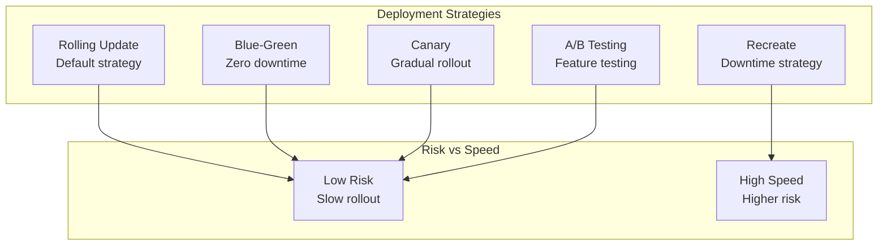
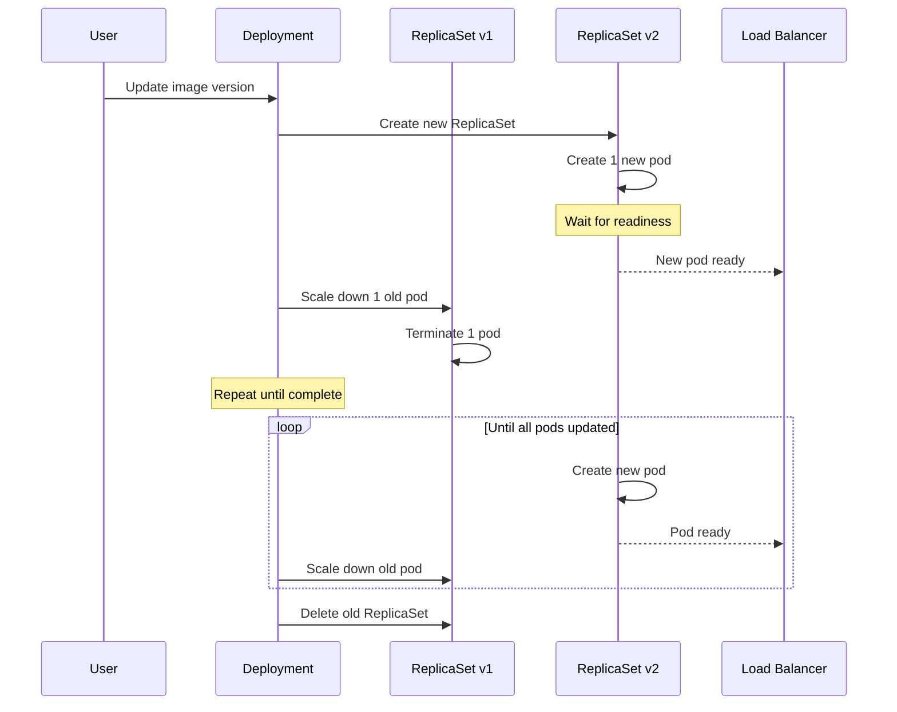
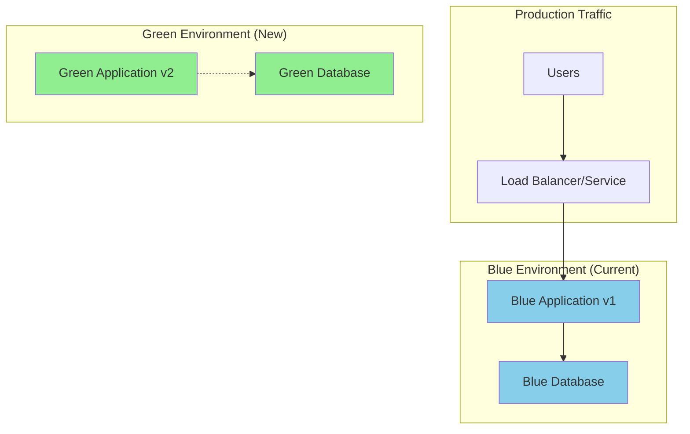
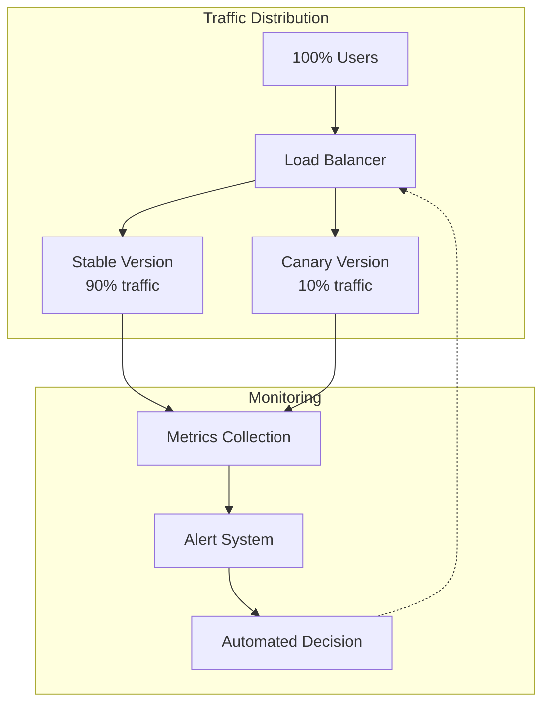
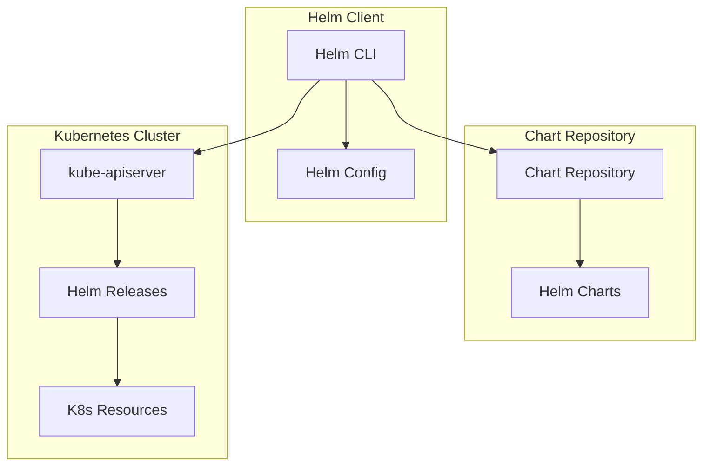
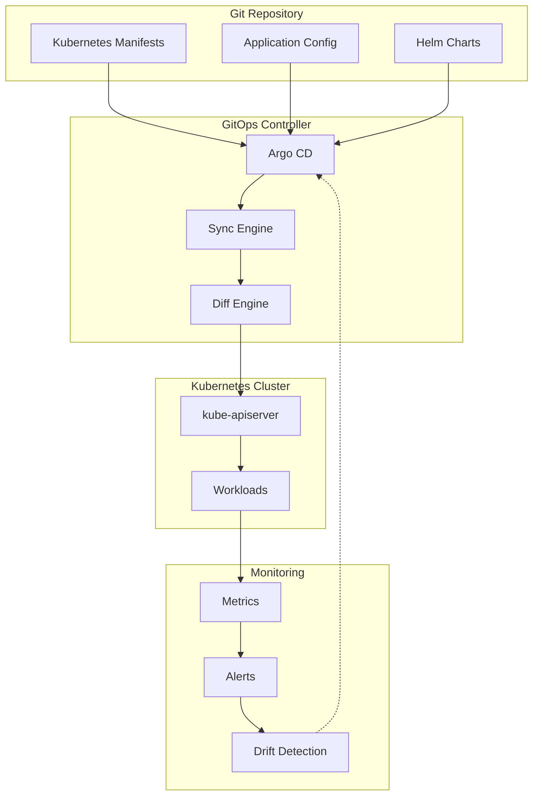
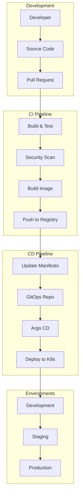

# Deployment & Release - Lý thuyết chuyên sâu

## 🎯 Tổng quan Deployment Strategies

Kubernetes cung cấp nhiều strategies để deploy applications một cách an toàn và hiệu quả.



## 🔄 Rolling Update - Default Strategy

### Rolling Update Process



### Rolling Update Configuration

```yaml
apiVersion: apps/v1
kind: Deployment
metadata:
  name: rolling-app
spec:
  replicas: 10
  strategy:
    type: RollingUpdate
    rollingUpdate:
      maxSurge: 25%        # Tối đa 2-3 pods mới (25% of 10)
      maxUnavailable: 25%  # Tối đa 2-3 pods unavailable
      progressDeadlineSeconds: 600  # Timeout 10 phút
  template:
    spec:
      containers:
      - name: app
        image: myapp:v2
        readinessProbe:
          httpGet:
            path: /health
            port: 8080
          initialDelaySeconds: 10
          periodSeconds: 5
        livenessProbe:
          httpGet:
            path: /health
            port: 8080
          initialDelaySeconds: 30
          periodSeconds: 10
```

**Ưu điểm**:
- Zero downtime (nếu có readiness probe)
- Gradual rollout
- Easy rollback

**Nhược điểm**:
- Mixed versions during rollout
- Slower deployment
- Resource overhead

## 🔵🟢 Blue-Green Deployment

### Blue-Green Architecture



### Blue-Green Implementation

```yaml
# Blue Deployment
apiVersion: apps/v1
kind: Deployment
metadata:
  name: app-blue
  labels:
    version: blue
spec:
  replicas: 3
  selector:
    matchLabels:
      app: myapp
      version: blue
  template:
    metadata:
      labels:
        app: myapp
        version: blue
    spec:
      containers:
      - name: app
        image: myapp:v1

---
# Green Deployment
apiVersion: apps/v1
kind: Deployment
metadata:
  name: app-green
  labels:
    version: green
spec:
  replicas: 3
  selector:
    matchLabels:
      app: myapp
      version: green
  template:
    metadata:
      labels:
        app: myapp
        version: green
    spec:
      containers:
      - name: app
        image: myapp:v2

---
# Service (initially points to blue)
apiVersion: v1
kind: Service
metadata:
  name: myapp-service
spec:
  selector:
    app: myapp
    version: blue  # Switch to green when ready
  ports:
  - port: 80
    targetPort: 8080
```

### Traffic Switching

```bash
# Deploy green version
kubectl apply -f app-green.yaml

# Test green version
kubectl port-forward service/app-green 8080:80
curl http://localhost:8080/health

# Switch traffic to green
kubectl patch service myapp-service -p '{"spec":{"selector":{"version":"green"}}}'

# Rollback if needed
kubectl patch service myapp-service -p '{"spec":{"selector":{"version":"blue"}}}'

# Cleanup old version
kubectl delete deployment app-blue
```

**Ưu điểm**:
- Instant rollback
- Zero downtime
- Full testing before switch

**Nhược điểm**:
- Double resources required
- Database migration complexity
- State synchronization issues

## 🕯️ Canary Deployment

### Canary Strategy



### Argo Rollouts Implementation

```yaml
apiVersion: argoproj.io/v1alpha1
kind: Rollout
metadata:
  name: canary-rollout
spec:
  replicas: 10
  strategy:
    canary:
      steps:
      - setWeight: 10    # 10% traffic to canary
      - pause: {duration: 30s}
      - setWeight: 20    # 20% traffic to canary
      - pause: {duration: 30s}
      - setWeight: 50    # 50% traffic to canary
      - pause: {duration: 30s}
      - setWeight: 100   # 100% traffic to canary
      
      # Automated analysis
      analysis:
        templates:
        - templateName: success-rate
        args:
        - name: service-name
          value: canary-service
        
      # Traffic routing
      trafficRouting:
        nginx:
          stableService: stable-service
          canaryService: canary-service
          
  selector:
    matchLabels:
      app: canary-app
  template:
    metadata:
      labels:
        app: canary-app
    spec:
      containers:
      - name: app
        image: myapp:v2
```

### Analysis Template

```yaml
apiVersion: argoproj.io/v1alpha1
kind: AnalysisTemplate
metadata:
  name: success-rate
spec:
  args:
  - name: service-name
  metrics:
  - name: success-rate
    interval: 30s
    count: 5
    successCondition: result[0] >= 0.95
    failureLimit: 3
    provider:
      prometheus:
        address: http://prometheus:9090
        query: |
          sum(rate(http_requests_total{service="{{args.service-name}}",status!~"5.."}[5m])) /
          sum(rate(http_requests_total{service="{{args.service-name}}"}[5m]))
```

## 📦 Helm - Package Manager

### Helm Architecture



### Chart Structure

```
mychart/
├── Chart.yaml          # Chart metadata
├── values.yaml         # Default values
├── charts/             # Chart dependencies
├── templates/          # Kubernetes templates
│   ├── deployment.yaml
│   ├── service.yaml
│   ├── ingress.yaml
│   ├── _helpers.tpl    # Template helpers
│   └── NOTES.txt       # Post-install notes
└── .helmignore         # Files to ignore
```

### Chart Template Example

```yaml
# templates/deployment.yaml
apiVersion: apps/v1
kind: Deployment
metadata:
  name: {{ include "mychart.fullname" . }}
  labels:
    {{- include "mychart.labels" . | nindent 4 }}
spec:
  replicas: {{ .Values.replicaCount }}
  selector:
    matchLabels:
      {{- include "mychart.selectorLabels" . | nindent 6 }}
  template:
    metadata:
      labels:
        {{- include "mychart.selectorLabels" . | nindent 8 }}
    spec:
      containers:
      - name: {{ .Chart.Name }}
        image: "{{ .Values.image.repository }}:{{ .Values.image.tag }}"
        ports:
        - containerPort: {{ .Values.service.targetPort }}
        {{- if .Values.resources }}
        resources:
          {{- toYaml .Values.resources | nindent 10 }}
        {{- end }}
```

### Values File

```yaml
# values.yaml
replicaCount: 3

image:
  repository: myapp
  tag: "1.0.0"
  pullPolicy: IfNotPresent

service:
  type: ClusterIP
  port: 80
  targetPort: 8080

ingress:
  enabled: false
  className: ""
  annotations: {}
  hosts:
  - host: myapp.local
    paths:
    - path: /
      pathType: Prefix

resources:
  limits:
    cpu: 500m
    memory: 512Mi
  requests:
    cpu: 250m
    memory: 256Mi

autoscaling:
  enabled: false
  minReplicas: 1
  maxReplicas: 100
  targetCPUUtilizationPercentage: 80
```

## 🔄 GitOps với Argo CD

### GitOps Principles



### Argo CD Application

```yaml
apiVersion: argoproj.io/v1alpha1
kind: Application
metadata:
  name: myapp
  namespace: argocd
spec:
  project: default
  
  source:
    repoURL: https://github.com/myorg/myapp-config
    targetRevision: HEAD
    path: k8s/overlays/production
    
    # Helm source
    helm:
      valueFiles:
      - values-production.yaml
      parameters:
      - name: image.tag
        value: v1.2.3
        
  destination:
    server: https://kubernetes.default.svc
    namespace: production
    
  syncPolicy:
    automated:
      prune: true
      selfHeal: true
      allowEmpty: false
    syncOptions:
    - CreateNamespace=true
    - PrunePropagationPolicy=foreground
    
    retry:
      limit: 5
      backoff:
        duration: 5s
        factor: 2
        maxDuration: 3m
```

### ApplicationSet for Multi-Environment

```yaml
apiVersion: argoproj.io/v1alpha1
kind: ApplicationSet
metadata:
  name: myapp-environments
spec:
  generators:
  - list:
      elements:
      - cluster: dev
        url: https://dev-cluster
        namespace: myapp-dev
        values: values-dev.yaml
      - cluster: staging
        url: https://staging-cluster
        namespace: myapp-staging
        values: values-staging.yaml
      - cluster: production
        url: https://prod-cluster
        namespace: myapp-prod
        values: values-production.yaml
        
  template:
    metadata:
      name: 'myapp-{{cluster}}'
    spec:
      project: default
      source:
        repoURL: https://github.com/myorg/myapp-config
        targetRevision: HEAD
        path: helm/myapp
        helm:
          valueFiles:
          - '{{values}}'
      destination:
        server: '{{url}}'
        namespace: '{{namespace}}'
      syncPolicy:
        automated:
          prune: true
          selfHeal: true
```

## 🚀 CI/CD Pipeline Integration

### Complete CI/CD Flow



### GitHub Actions Example

```yaml
name: CI/CD Pipeline

on:
  push:
    branches: [main]
  pull_request:
    branches: [main]

jobs:
  build:
    runs-on: ubuntu-latest
    steps:
    - uses: actions/checkout@v3
    
    - name: Setup Go
      uses: actions/setup-go@v3
      with:
        go-version: 1.19
        
    - name: Run tests
      run: go test ./...
      
    - name: Build binary
      run: go build -o app .
      
    - name: Security scan
      uses: securecodewarrior/github-action-add-sarif@v1
      with:
        sarif-file: security-scan.sarif
        
    - name: Build Docker image
      run: |
        docker build -t myapp:${{ github.sha }} .
        docker tag myapp:${{ github.sha }} myapp:latest
        
    - name: Push to registry
      run: |
        echo ${{ secrets.DOCKER_PASSWORD }} | docker login -u ${{ secrets.DOCKER_USERNAME }} --password-stdin
        docker push myapp:${{ github.sha }}
        docker push myapp:latest
        
    - name: Update manifests
      run: |
        git clone https://github.com/myorg/myapp-config
        cd myapp-config
        sed -i 's|image: myapp:.*|image: myapp:${{ github.sha }}|' k8s/overlays/staging/kustomization.yaml
        git add .
        git commit -m "Update image to ${{ github.sha }}"
        git push
```

## 🔧 Advanced Deployment Patterns

### 1. Feature Flags Integration

```yaml
apiVersion: apps/v1
kind: Deployment
metadata:
  name: feature-flag-app
spec:
  template:
    spec:
      containers:
      - name: app
        image: myapp:v2
        env:
        - name: FEATURE_NEW_UI
          valueFrom:
            configMapKeyRef:
              name: feature-flags
              key: new-ui
        - name: FEATURE_BETA_API
          valueFrom:
            configMapKeyRef:
              name: feature-flags
              key: beta-api
```

### 2. Database Migration Jobs

```yaml
apiVersion: batch/v1
kind: Job
metadata:
  name: db-migration-v2
  annotations:
    argocd.argoproj.io/hook: PreSync
    argocd.argoproj.io/hook-delete-policy: BeforeHookCreation
spec:
  template:
    spec:
      containers:
      - name: migrate
        image: migrate/migrate
        command:
        - migrate
        - -path=/migrations
        - -database=postgres://user:pass@db:5432/mydb?sslmode=disable
        - up
        volumeMounts:
        - name: migrations
          mountPath: /migrations
      volumes:
      - name: migrations
        configMap:
          name: db-migrations
      restartPolicy: Never
```

### 3. Progressive Delivery với Flagger

```yaml
apiVersion: flagger.app/v1beta1
kind: Canary
metadata:
  name: myapp
spec:
  targetRef:
    apiVersion: apps/v1
    kind: Deployment
    name: myapp
  progressDeadlineSeconds: 60
  service:
    port: 80
    targetPort: 8080
  analysis:
    interval: 30s
    threshold: 5
    maxWeight: 50
    stepWeight: 10
    metrics:
    - name: request-success-rate
      thresholdRange:
        min: 99
      interval: 1m
    - name: request-duration
      thresholdRange:
        max: 500
      interval: 30s
    webhooks:
    - name: load-test
      url: http://flagger-loadtester.test/
      metadata:
        cmd: "hey -z 1m -q 10 -c 2 http://myapp.test/"
```

## 📊 Monitoring và Observability

### Deployment Metrics

```yaml
apiVersion: v1
kind: ServiceMonitor
metadata:
  name: deployment-metrics
spec:
  selector:
    matchLabels:
      app: myapp
  endpoints:
  - port: metrics
    interval: 30s
    path: /metrics
```

### Alerting Rules

```yaml
apiVersion: monitoring.coreos.com/v1
kind: PrometheusRule
metadata:
  name: deployment-alerts
spec:
  groups:
  - name: deployment.rules
    rules:
    - alert: DeploymentReplicasMismatch
      expr: kube_deployment_spec_replicas != kube_deployment_status_ready_replicas
      for: 5m
      labels:
        severity: warning
      annotations:
        summary: "Deployment {{ $labels.deployment }} has mismatched replicas"
        
    - alert: DeploymentRolloutStuck
      expr: kube_deployment_status_condition{condition="Progressing",status="false"} == 1
      for: 10m
      labels:
        severity: critical
      annotations:
        summary: "Deployment {{ $labels.deployment }} rollout is stuck"
```

## 🛡️ Security trong CI/CD

### 1. Image Scanning

```yaml
# .github/workflows/security.yml
- name: Run Trivy vulnerability scanner
  uses: aquasecurity/trivy-action@master
  with:
    image-ref: 'myapp:${{ github.sha }}'
    format: 'sarif'
    output: 'trivy-results.sarif'
    
- name: Upload Trivy scan results
  uses: github/codeql-action/upload-sarif@v2
  with:
    sarif_file: 'trivy-results.sarif'
```

### 2. Policy as Code

```yaml
apiVersion: kyverno.io/v1
kind: ClusterPolicy
metadata:
  name: require-image-signature
spec:
  validationFailureAction: enforce
  background: false
  rules:
  - name: check-signature
    match:
      any:
      - resources:
          kinds:
          - Pod
    verifyImages:
    - imageReferences:
      - "myregistry.com/*"
      attestors:
      - entries:
        - keys:
            publicKeys: |-
              -----BEGIN PUBLIC KEY-----
              MFkwEwYHKoZIzj0CAQYIKoZIzj0DAQcDQgAE...
              -----END PUBLIC KEY-----
```

### 3. Secret Management

```yaml
apiVersion: external-secrets.io/v1beta1
kind: ExternalSecret
metadata:
  name: app-secrets
spec:
  refreshInterval: 15s
  secretStoreRef:
    name: vault-backend
    kind: SecretStore
  target:
    name: app-secrets
    creationPolicy: Owner
  data:
  - secretKey: database-password
    remoteRef:
      key: secret/myapp
      property: db_password
```

## 🤔 Câu hỏi suy ngẫm

1. **Khi nào nên dùng Blue-Green vs Canary?**
   - Blue-Green: Critical systems, instant rollback needed
   - Canary: Gradual validation, risk mitigation

2. **GitOps có thay thế được traditional CI/CD không?**
   - GitOps: Declarative, audit trail, consistency
   - Traditional: Imperative, faster feedback
   - Best: Hybrid approach

3. **Làm thế nào để handle database migrations?**
   - Backward compatible changes
   - Pre/post deployment hooks
   - Separate migration pipelines

4. **Security trong automated deployments?**
   - Image scanning
   - Policy enforcement
   - Secret management
   - Audit logging